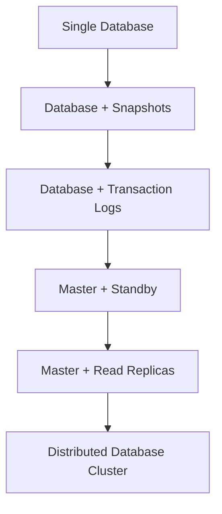

# 🗄️ GCP Database Guide for Senior DevOps Engineers

## Table of Contents
1. [Database Fundamentals](#database-fundamentals)
2. [Availability & Durability](#availability--durability)
3. [RTO & RPO Concepts](#rto--rpo-concepts)
4. [Database Consistency Models](#database-consistency-models)
5. [GCP Database Services](#gcp-database-services)
6. [Cloud SQL Deep Dive](#cloud-sql-deep-dive)
7. [Cloud Spanner Architecture](#cloud-spanner-architecture)
8. [NoSQL Solutions](#nosql-solutions)
9. [Caching Strategies](#caching-strategies)
10. [Migration & Best Practices](#migration--best-practices)
11. [Monitoring & Troubleshooting](#monitoring--troubleshooting)
12. [Cost Optimization](#cost-optimization)

---

## 🔹 Database Fundamentals

### Core Database Challenges

```yaml
# Primary Database Challenges:
Single Point of Failure: Database crashes = application down
Data Loss Risk: Hardware failures can destroy data
Performance Bottlenecks: Slow queries impact user experience
Scalability Limits: Growing data and users strain resources
Consistency Issues: Multiple replicas may have different data
```

### Evolution of Database Architecture



### Database Types Overview

| Type | Use Case | GCP Service | Best For |
|------|----------|-------------|----------|
| **OLTP** | Transactional apps | Cloud SQL, Spanner | E-commerce, Banking |
| **OLAP** | Analytics | BigQuery | Data warehousing |
| **Document** | Flexible schema | Firestore | Mobile apps, CMS |
| **Wide Column** | Time series | BigTable | IoT, Analytics |
| **In-Memory** | Caching | Memorystore | Session storage |
| **Graph** | Relationships | Neo4j on GCE | Social networks |

---

## 🔹 Availability & Durability

### Understanding the 9's

```yaml
# Availability Metrics:
99.9% (3 9's):    8.77 hours downtime/year
99.99% (4 9's):   52.6 minutes downtime/year  # Standard target
99.999% (5 9's):  5.26 minutes downtime/year  # High availability
99.9999% (6 9's): 31.5 seconds downtime/year  # Mission critical

# Durability Metrics:
99.999999999% (11 9's): Lose 1 file per 10M files over 10M years
```

### Availability Strategies

```yaml
# Multi-Zone Deployment:
Primary Zone: us-central1-a
Secondary Zone: us-central1-b
Benefit: Protection against zone failures
RTO: 1-5 minutes (automatic failover)

# Multi-Region Deployment:
Primary Region: us-central1
Secondary Region: us-east1
Benefit: Protection against regional disasters
RTO: 5-30 minutes (manual or automatic)

# Global Distribution:
Regions: us-central1, europe-west1, asia-southeast1
Benefit: Low latency worldwide + disaster recovery
RTO: Varies by implementation
```

### Durability Implementation

```yaml
# Data Protection Layers:
1. Local Redundancy: Multiple disk copies in same zone
2. Zonal Redundancy: Copies across zones in region
3. Regional Redundancy: Copies across regions
4. Backup Strategy: Point-in-time recovery
5. Archive Strategy: Long-term retention

# Example: Cloud SQL HA Configuration
Primary Instance: us-central1-a
Standby Instance: us-central1-b
Automated Backups: Daily + transaction logs
Cross-Region Replicas: us-east1 (disaster recovery)
```

---

## 🔹 RTO & RPO Concepts

### Recovery Objectives Explained

```yaml
# RTO (Recovery Time Objective):
Definition: Maximum acceptable downtime
Measurement: Time to restore service after failure
Business Impact: Revenue loss, SLA violations

# RPO (Recovery Point Objective):
Definition: Maximum acceptable data loss
Measurement: Time between last backup and failure
Business Impact: Lost transactions, compliance issues
```

### RTO/RPO Implementation Matrix

| Scenario | RTO Target | RPO Target | GCP Solution | Cost |
|----------|------------|------------|--------------|------|
| **Mission Critical** | < 1 minute | < 1 minute | Spanner Multi-Region | $$$$$ |
| **High Availability** | < 5 minutes | < 5 minutes | Cloud SQL HA + Read Replicas | $$$$ |
| **Standard Production** | < 15 minutes | < 15 minutes | Cloud SQL Regional + Backups | $$$ |
| **Development** | < 1 hour | < 1 hour | Single Instance + Daily Backups | $$ |
| **Archive/Reporting** | < 4 hours | < 24 hours | BigQuery + Cloud Storage | $ |

### Practical RTO/RPO Scenarios

```yaml
# Scenario 1: E-commerce Platform
Business Requirement: 99.99% availability
RTO: 2 minutes (revenue loss = $10k/minute)
RPO: 30 seconds (transaction loss unacceptable)

Solution:
- Cloud Spanner multi-region
- Automatic failover
- Synchronous replication
- Cost: ~$3000/month

# Scenario 2: Internal CRM
Business Requirement: 99.9% availability
RTO: 15 minutes (internal productivity impact)
RPO: 5 minutes (some data loss acceptable)

Solution:
- Cloud SQL HA configuration
- Automated backups every 5 minutes
- Read replicas for reporting
- Cost: ~$800/month

# Scenario 3: Analytics Warehouse
Business Requirement: 99% availability
RTO: 2 hours (batch processing can wait)
RPO: 4 hours (historical data, not real-time)

Solution:
- BigQuery with scheduled exports
- Cloud Storage for backup
- Manual recovery process
- Cost: ~$200/month
```

---

## 🔹 Database Consistency Models

### Consistency Types

```yaml
# Strong Consistency (ACID):
Guarantee: All reads receive the most recent write
Use Case: Financial transactions, inventory management
GCP Services: Cloud Spanner, Cloud SQL
Trade-off: Higher latency, lower availability

# Eventual Consistency:
Guarantee: System will become consistent over time
Use Case: Social media posts, content distribution
GCP Services: Firestore, BigTable
Trade-off: Lower latency, higher availability

# Read-After-Write Consistency:
Guarantee: Users see their own writes immediately
Use Case: User profiles, personal data
GCP Services: Firestore (with proper configuration)
Trade-off: Balanced approach
```

### CAP Theorem in Practice

```yaml
# CAP Theorem: Choose 2 of 3
Consistency: All nodes see same data simultaneously
Availability: System remains operational
Partition Tolerance: System continues despite network failures

# GCP Service Classifications:
Cloud Spanner: CP (Consistency + Partition Tolerance)
- Strong consistency across regions
- May sacrifice availability during network partitions

Cloud SQL: CA (Consistency + Availability)
- Strong consistency within region
- Limited partition tolerance (single region)

Firestore: AP (Availability + Partition Tolerance)
- Eventually consistent
- Highly available across partitions
```

---

## 🔹 GCP Database Services

### Service Selection Matrix

```yaml
# Decision Tree:
1. Data Size?
   < 10TB: Cloud SQL or Firestore
   > 10TB: Spanner, BigTable, or BigQuery

2. Schema Requirements?
   Fixed Schema: Cloud SQL, Spanner, BigQuery
   Flexible Schema: Firestore, BigTable

3. Transaction Requirements?
   ACID Transactions: Cloud SQL, Spanner
   Single-Row Transactions: BigTable
   Document Transactions: Firestore

4. Global Distribution?
   Regional: Cloud SQL
   Global: Spanner, Firestore

5. Query Complexity?
   Complex SQL: Cloud SQL, Spanner, BigQuery
   Simple Queries: Firestore, BigTable
   Analytics: BigQuery
```

### Service Comparison

| Feature | Cloud SQL | Spanner | Firestore | BigTable | BigQuery |
|---------|-----------|---------|-----------|----------|----------|
| **Max Size** | 30TB | Unlimited | Few TB | Petabytes | Petabytes |
| **Consistency** | Strong | Strong | Eventual | Eventual | Strong |
| **Transactions** | ACID | ACID | ACID | Single-row | None |
| **Global** | No | Yes | Yes | No | Yes |
| **SQL Support** | Full | Full | GQL | None | Full |
| **Serverless** | No | No | Yes | No | Yes |
| **Cost** | $$ | $$$$$ | $ | $$$ | $ |

---

## 🔹 Cloud SQL Deep Dive

### Architecture Options

```yaml
# Single Instance (Development):
Configuration: Single zone deployment
Availability: 99.95%
Use Case: Development, testing
Cost: ~$50-200/month

# High Availability (Production):
Configuration: Primary + Standby in different zones
Availability: 99.95%
Failover: Automatic (60-120 seconds)
Cost: ~2x single instance

# Read Replicas (Scale Reads):
Configuration: Master + multiple read replicas
Use Case: Read-heavy workloads, reporting
Locations: Same region, cross-region, external
Cost: +50% per replica
```

### Cloud SQL Best Practices

```yaml
# Performance Optimization:
1. Instance Sizing:
   - Start with db-n1-standard-2 (2 vCPU, 7.5GB RAM)
   - Monitor CPU/Memory utilization
   - Scale vertically before horizontally

2. Storage Configuration:
   - Use SSD for production workloads
   - Enable automatic storage increase
   - Monitor IOPS and throughput

3. Connection Management:
   - Use connection pooling (PgBouncer for PostgreSQL)
   - Implement Cloud SQL Proxy for secure connections
   - Monitor connection count vs limits

# Security Best Practices:
1. Network Security:
   - Use private IP when possible
   - Implement authorized networks
   - Enable SSL/TLS encryption

2. Access Control:
   - Use IAM for Cloud SQL access
   - Implement least privilege principle
   - Regular access reviews

3. Data Protection:
   - Enable automated backups
   - Configure backup retention policy
   - Test backup restoration regularly
```

### Cloud SQL Monitoring

```yaml
# Key Metrics to Monitor:
Database Connections:
  - Current connections vs max connections
  - Connection rate and duration
  - Failed connection attempts

Performance Metrics:
  - CPU utilization (target < 80%)
  - Memory utilization (target < 85%)
  - Disk I/O operations and latency
  - Query execution time

Availability Metrics:
  - Instance uptime
  - Failover events
  - Backup success rate
  - Replication lag (for read replicas)

# Alerting Thresholds:
CPU > 80% for 5 minutes: Scale up instance
Memory > 85% for 5 minutes: Scale up instance
Connections > 80% of max: Investigate connection leaks
Replication lag > 60 seconds: Check network/load
Backup failures: Immediate investigation required
```

---

## 🔹 Cloud Spanner Architecture

### Global Distribution

```yaml
# Multi-Region Configuration:
Primary Region: us-central1 (Iowa)
Secondary Regions: us-east1 (South Carolina), europe-west1 (Belgium)

Benefits:
- Global strong consistency
- Automatic failover
- Low latency reads worldwide
- 99.999% availability SLA

# Node Configuration:
Regional Instance: 3 nodes minimum (1 per zone)
Multi-Region Instance: 3 nodes minimum per region
Processing Units: 1000 PU = 1 node (can use fractional)

# Cost Calculation:
Regional: $0.90/node/hour + $0.30/GB/month storage
Multi-Region: $3.00/node/hour + $0.50/GB/month storage
```

### Spanner Best Practices

```yaml
# Schema Design:
1. Primary Key Design:
   - Avoid monotonically increasing keys (timestamps, sequences)
   - Use UUID or hash-based keys for even distribution
   - Consider composite keys for related data

2. Interleaved Tables:
   - Co-locate related data (parent-child relationships)
   - Reduces cross-node transactions
   - Improves query performance

# Performance Optimization:
1. Query Patterns:
   - Use strongly typed parameters
   - Avoid SELECT * queries
   - Implement proper indexing strategy
   - Use LIMIT for large result sets

2. Transaction Management:
   - Keep transactions short
   - Avoid cross-region transactions when possible
   - Use read-only transactions for better performance
   - Implement retry logic with exponential backoff

# Monitoring Spanner:
Key Metrics:
- CPU utilization per region/node
- Storage utilization
- Query latency (p50, p95, p99)
- Transaction commit latency
- Lock wait time

Alerting:
- CPU > 65% sustained: Add nodes
- Storage > 80%: Monitor growth
- Query latency > 100ms p95: Optimize queries
- Lock wait time > 10ms: Review transaction patterns
```

---

## 🔹 NoSQL Solutions

### Firestore (Document Database)

```yaml
# Architecture:
Document Structure: Collections > Documents > Fields
Indexing: Automatic + composite indexes
Transactions: Multi-document ACID transactions
Scaling: Automatic horizontal scaling

# Use Cases:
- Mobile applications
- Real-time collaboration
- User profiles and preferences
- Content management systems
- Gaming leaderboards

# Best Practices:
1. Document Design:
   - Keep documents under 1MB
   - Denormalize data for read efficiency
   - Use subcollections for hierarchical data
   - Avoid deep nesting (max 20 levels)

2. Query Optimization:
   - Create composite indexes for complex queries
   - Use pagination for large result sets
   - Implement proper security rules
   - Cache frequently accessed data

# Pricing Model:
- Document reads: $0.06 per 100K
- Document writes: $0.18 per 100K
- Document deletes: $0.02 per 100K
- Storage: $0.18/GB/month
- Network egress: Standard rates
```

### BigTable (Wide Column)

```yaml
# Architecture:
Row Key: Primary index (only index available)
Column Families: Group related columns
Cells: Timestamped values
Tablets: Automatic data sharding

# Use Cases:
- Time series data (IoT sensors, metrics)
- Financial data (trading, transactions)
- AdTech (user behavior, campaigns)
- Gaming (player statistics, leaderboards)
- Real-time analytics

# Schema Design:
1. Row Key Design:
   - Distribute load evenly across tablets
   - Avoid sequential keys (timestamps)
   - Use reverse timestamp for recent data queries
   - Consider salting for hot-spotting

2. Column Family Design:
   - Group related data together
   - Limit number of column families (< 100)
   - Use appropriate garbage collection policies
   - Consider compression settings

# Performance Tuning:
Cluster Configuration:
- Start with 3 nodes minimum
- Use SSD for low-latency workloads
- Use HDD for large, infrequent access data
- Monitor CPU and storage utilization

Query Optimization:
- Use row key ranges for efficient scans
- Implement proper filtering
- Use column family and qualifier filters
- Batch operations when possible

# Monitoring BigTable:
Key Metrics:
- CPU utilization per node
- Storage utilization per node
- Request latency (read/write)
- Error rates
- Hot-spotting indicators

Scaling Decisions:
- CPU > 70%: Add nodes
- Storage > 70%: Add nodes or optimize data
- High latency: Check for hot-spotting
- Uneven load: Review row key design
```

---

## 🔹 Caching Strategies

### Memorystore (Redis/Memcached)

```yaml
# Service Tiers:
Basic Tier:
- Single node
- No replication
- 99.9% availability SLA
- Lower cost
- Use for: Development, caching

Standard Tier:
- Primary + replica nodes
- Automatic failover
- 99.9% availability SLA
- Cross-zone replication
- Use for: Production applications

# Capacity Planning:
Memory Sizing:
- Monitor cache hit ratio (target > 95%)
- Plan for peak usage + 20% buffer
- Consider data growth over time
- Account for Redis overhead (~25%)

Network Bandwidth:
- Monitor network utilization
- Consider read/write patterns
- Plan for traffic spikes
- Use VPC peering for optimal performance
```

### Caching Patterns

```yaml
# Cache-Aside Pattern:
Application Logic:
1. Check cache for data
2. If cache miss, query database
3. Store result in cache
4. Return data to user

Use Case: Read-heavy workloads
Benefits: Simple implementation, cache failures don't break app
Drawbacks: Cache misses cause latency spikes

# Write-Through Pattern:
Application Logic:
1. Write data to cache
2. Write data to database
3. Return success to user

Use Case: Write-heavy workloads with read requirements
Benefits: Data consistency, cache always up-to-date
Drawbacks: Higher write latency

# Write-Behind Pattern:
Application Logic:
1. Write data to cache
2. Return success to user
3. Asynchronously write to database

Use Case: High-throughput writes
Benefits: Low write latency
Drawbacks: Risk of data loss, complexity

# Cache Invalidation Strategies:
TTL (Time To Live):
- Set expiration time for cache entries
- Good for data that changes predictably
- Simple to implement

Event-Based Invalidation:
- Invalidate cache when data changes
- Use Pub/Sub for distributed invalidation
- More complex but more efficient

Version-Based Invalidation:
- Include version number in cache keys
- Increment version on data changes
- Allows gradual cache updates
```

### Caching Best Practices

```yaml
# Cache Key Design:
Naming Convention: service:entity:id:version
Examples:
- user:profile:12345:v2
- product:details:abc123:v1
- session:data:xyz789:v1

Benefits:
- Easy to understand and debug
- Supports versioning
- Enables bulk operations
- Facilitates monitoring

# Cache Monitoring:
Key Metrics:
- Hit ratio (target > 95%)
- Memory utilization (target < 80%)
- Eviction rate
- Connection count
- Response time

Alerting:
- Hit ratio < 90%: Review cache strategy
- Memory > 85%: Scale up or optimize
- High eviction rate: Increase memory or TTL
- Connection issues: Check network/security

# Cache Security:
Network Security:
- Use private IP addresses
- Implement VPC firewall rules
- Enable AUTH for Redis
- Use SSL/TLS for data in transit

Access Control:
- Implement IAM roles
- Use service accounts
- Regular access reviews
- Monitor access patterns
```

---

## 🔹 Migration & Best Practices

### Database Migration Strategies

```yaml
# Lift and Shift Migration:
Approach: Migrate existing database as-is
Tools: Database Migration Service (DMS)
Timeline: Weeks to months
Risk: Low (minimal changes)
Benefits: Quick migration, familiar environment
Drawbacks: May not leverage cloud benefits

Steps:
1. Assessment and planning
2. Set up target environment
3. Initial data migration
4. Continuous replication
5. Cutover and validation

# Modernization Migration:
Approach: Redesign for cloud-native architecture
Tools: Custom migration scripts, ETL tools
Timeline: Months to years
Risk: High (significant changes)
Benefits: Optimized performance, cost savings
Drawbacks: Complex, requires application changes

Steps:
1. Application assessment
2. Architecture redesign
3. Schema optimization
4. Application refactoring
5. Gradual migration
6. Performance tuning

# Hybrid Migration:
Approach: Gradual migration with coexistence
Tools: DMS + custom solutions
Timeline: Months
Risk: Medium
Benefits: Reduced risk, gradual transition
Drawbacks: Complex management during transition
```

### Migration Tools and Services

```yaml
# Database Migration Service (DMS):
Supported Sources:
- MySQL, PostgreSQL, SQL Server
- Oracle, MongoDB
- On-premises and cloud databases

Supported Targets:
- Cloud SQL
- AlloyDB
- Cloud Spanner (with schema conversion)

Features:
- Continuous replication
- Minimal downtime migration
- Schema conversion assistance
- Validation and monitoring

# Migration Best Practices:
Pre-Migration:
1. Performance baseline establishment
2. Dependency mapping
3. Security requirements review
4. Backup and recovery planning
5. Rollback strategy definition

During Migration:
1. Parallel run validation
2. Performance monitoring
3. Data integrity checks
4. Application testing
5. User acceptance testing

Post-Migration:
1. Performance optimization
2. Cost monitoring
3. Security hardening
4. Backup validation
5. Documentation updates
```

---

## 🔹 Monitoring & Troubleshooting

### Comprehensive Monitoring Strategy

```yaml
# Infrastructure Monitoring:
Cloud Monitoring Metrics:
- CPU, Memory, Disk utilization
- Network throughput and latency
- Storage IOPS and latency
- Connection counts and errors

Custom Metrics:
- Application-specific KPIs
- Business logic performance
- User experience metrics
- SLA compliance tracking

# Database-Specific Monitoring:
Performance Metrics:
- Query execution time (p50, p95, p99)
- Transaction throughput
- Lock wait time
- Index usage statistics
- Buffer pool hit ratio

Availability Metrics:
- Uptime percentage
- Failover events
- Backup success rate
- Replication lag

# Alerting Strategy:
Severity Levels:
Critical: Service down, data loss risk
High: Performance degradation, SLA risk
Medium: Resource utilization warnings
Low: Informational, trend analysis

Alert Channels:
- PagerDuty for critical alerts
- Slack for high/medium alerts
- Email for low priority alerts
- Dashboard for trend monitoring
```

### Troubleshooting Playbooks

```yaml
# High CPU Utilization:
Investigation Steps:
1. Identify top queries using Query Insights
2. Check for missing indexes
3. Review query execution plans
4. Analyze connection patterns
5. Check for lock contention

Resolution Actions:
- Optimize slow queries
- Add missing indexes
- Scale up instance size
- Implement connection pooling
- Consider read replicas

# High Memory Usage:
Investigation Steps:
1. Check buffer pool utilization
2. Review connection count
3. Analyze query complexity
4. Check for memory leaks
5. Review caching strategy

Resolution Actions:
- Optimize query memory usage
- Reduce connection count
- Scale up instance memory
- Implement query result caching
- Review application connection handling

# Replication Lag:
Investigation Steps:
1. Check network connectivity
2. Review primary database load
3. Analyze replication configuration
4. Check for long-running transactions
5. Monitor disk I/O on replica

Resolution Actions:
- Optimize network configuration
- Reduce primary database load
- Scale up replica resources
- Implement read load balancing
- Consider parallel replication

# Connection Issues:
Investigation Steps:
1. Check connection limits
2. Review firewall rules
3. Analyze SSL/TLS configuration
4. Check DNS resolution
5. Review application connection logic

Resolution Actions:
- Increase connection limits
- Update firewall rules
- Fix SSL/TLS configuration
- Implement connection pooling
- Add connection retry logic
```

---

## 🔹 Cost Optimization

### Cost Management Strategies

```yaml
# Right-Sizing Resources:
Cloud SQL Optimization:
- Monitor CPU/Memory utilization
- Use committed use discounts (1-3 years)
- Implement automatic scaling policies
- Regular instance size reviews

Spanner Optimization:
- Use processing units instead of full nodes
- Implement regional vs multi-regional based on needs
- Monitor and optimize query performance
- Use committed use discounts

BigTable Optimization:
- Choose appropriate storage type (SSD vs HDD)
- Implement proper cluster sizing
- Use preemptible instances for development
- Regular capacity planning reviews

# Storage Cost Optimization:
Data Lifecycle Management:
- Implement automated backup retention
- Use nearline/coldline storage for archives
- Compress data where appropriate
- Regular data cleanup and archival

Backup Strategy:
- Optimize backup frequency
- Use incremental backups
- Implement cross-region backup only when needed
- Regular backup retention policy reviews

# Network Cost Optimization:
Data Transfer:
- Use regional resources when possible
- Implement CDN for static content
- Optimize query result sizes
- Use VPC peering for internal traffic

# Monitoring and Budgeting:
Cost Tracking:
- Set up billing alerts
- Use labels for cost attribution
- Regular cost reviews and optimization
- Implement showback/chargeback models

Budget Controls:
- Set project-level budgets
- Implement spending alerts
- Use quotas to prevent overruns
- Regular budget vs actual reviews
```

### Cost Optimization Checklist

```yaml
# Monthly Review Tasks:
□ Review resource utilization reports
□ Analyze cost trends and anomalies
□ Check for unused or underutilized resources
□ Review backup and retention policies
□ Validate committed use discount utilization
□ Update capacity planning forecasts

# Quarterly Review Tasks:
□ Comprehensive cost optimization review
□ Evaluate new GCP pricing options
□ Review and update budgets
□ Assess committed use discount renewals
□ Architecture review for cost optimization
□ Benchmark against industry standards

# Annual Review Tasks:
□ Complete cost optimization assessment
□ Review and negotiate enterprise agreements
□ Evaluate alternative architectures
□ Update disaster recovery cost models
□ Comprehensive security and compliance review
□ Strategic planning for next year's budget
```

---

## 🔹 Security Best Practices

### Database Security Framework

```yaml
# Identity and Access Management:
Service Accounts:
- Use dedicated service accounts per application
- Implement least privilege principle
- Regular access reviews and rotation
- Avoid using default service accounts

IAM Roles:
- Cloud SQL Admin: Full database management
- Cloud SQL Client: Connect to databases
- Cloud SQL Viewer: Read-only access
- Custom roles for specific needs

# Network Security:
Private IP Configuration:
- Use private IP for database instances
- Implement VPC peering for cross-project access
- Configure authorized networks carefully
- Use Cloud SQL Proxy for secure connections

Firewall Rules:
- Restrict database access to specific subnets
- Implement defense in depth
- Regular firewall rule audits
- Use network tags for organization

# Data Protection:
Encryption at Rest:
- Customer-managed encryption keys (CMEK)
- Regular key rotation policies
- Secure key management practices
- Compliance with regulatory requirements

Encryption in Transit:
- Enforce SSL/TLS connections
- Use strong cipher suites
- Certificate management
- Regular security assessments

# Audit and Compliance:
Audit Logging:
- Enable Cloud Audit Logs
- Monitor database access patterns
- Implement log retention policies
- Regular log analysis and alerting

Compliance Frameworks:
- SOC 2 Type II compliance
- PCI DSS for payment data
- HIPAA for healthcare data
- GDPR for EU data protection
```

---

This comprehensive guide covers the essential database concepts and GCP-specific implementations that you'll need as a senior DevOps engineer. Each section builds upon the fundamentals you outlined while adding practical, real-world insights for managing databases in production environments.

The guide emphasizes the operational aspects that DevOps engineers need to master: monitoring, troubleshooting, cost optimization, and security. It also provides decision frameworks and best practices that will help you make informed architectural choices based on specific requirements and constraints.