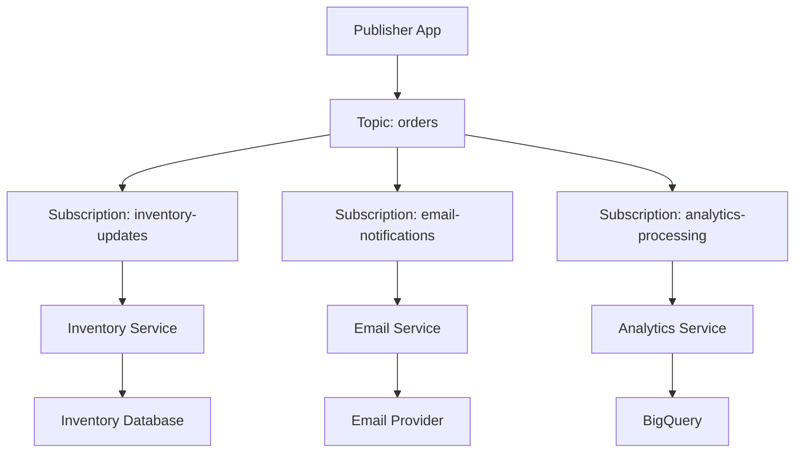

# 🔄 GCP Pub/Sub & Dataflow Guide for Senior DevOps Engineers

## Table of Contents
1. [Asynchronous Communication Fundamentals](#asynchronous-communication-fundamentals)
2. [Cloud Pub/Sub Architecture](#cloud-pubsub-architecture)
3. [Pub/Sub Implementation](#pubsub-implementation)
4. [Cloud Dataflow Integration](#cloud-dataflow-integration)
5. [Advanced Patterns](#advanced-patterns)
6. [Monitoring & Operations](#monitoring--operations)
7. [Security & Best Practices](#security--best-practices)
8. [Cost Optimization](#cost-optimization)
9. [Troubleshooting](#troubleshooting)

---

## 🔹 Asynchronous Communication Fundamentals

### The Problem with Synchronous Communication

```yaml
# Synchronous Communication Issues:
Tight Coupling:
  - Services depend on each other's availability
  - Cascading failures when one service goes down
  - Difficult to scale individual components

Performance Bottlenecks:
  - Blocking operations reduce throughput
  - Network latency affects user experience
  - Resource contention under high load

Scalability Limitations:
  - Hard to handle traffic spikes
  - Difficult to scale services independently
  - Single points of failure
```

### Real-World Synchronous Problems

```yaml
# E-commerce Order Processing (Synchronous):
User Places Order → Inventory Check → Payment Processing → Email Notification → Order Confirmation

Problems:
- If email service is down, entire order fails
- Payment delays block inventory updates
- High load on any service affects all others
- User waits for all services to complete

# Logging Service Example:
Application → Direct API Call → Logging Service → Database

Problems:
- App fails if logging service is unavailable
- High log volume can overwhelm logging service
- Network issues cause application errors
- No message persistence during outages
```

### Asynchronous Communication Benefits

```yaml
# Decoupling Advantages:
Service Independence:
  - Publishers don't know about subscribers
  - Services can be deployed independently
  - Failure isolation prevents cascading issues

Scalability:
  - Services scale based on their own load
  - Message queuing handles traffic spikes
  - Horizontal scaling of consumers

Reliability:
  - Messages persist until processed
  - Retry mechanisms for failed processing
  - Dead letter queues for problematic messages

Performance:
  - Non-blocking operations
  - Parallel processing capabilities
  - Better resource utilization
```

---

## 🔹 Cloud Pub/Sub Architecture

### Core Components

```yaml
# Pub/Sub Architecture:
Topic:
  - Named resource for message publishing
  - Messages are published to topics
  - Durable message storage

Subscription:
  - Named resource for message consumption
  - Attached to a single topic
  - Independent message streams

Publisher:
  - Application that sends messages
  - Can be any application or service
  - Uses Pub/Sub client libraries or REST API

Subscriber:
  - Application that receives messages
  - Pull or Push delivery methods
  - Acknowledges message processing
```

### Message Flow Architecture



### Delivery Methods

```yaml
# Pull Subscription:
How it works:
  - Subscriber actively requests messages
  - Subscriber controls message processing rate
  - Better for batch processing scenarios

Advantages:
  - Flow control by subscriber
  - Better for high-throughput scenarios
  - Subscriber can process multiple messages

Use Cases:
  - Batch data processing
  - High-volume message processing
  - When subscriber needs flow control

# Push Subscription:
How it works:
  - Pub/Sub delivers messages to HTTP endpoint
  - Automatic message delivery
  - Subscriber provides webhook URL

Advantages:
  - Real-time message delivery
  - No need for subscriber to poll
  - Automatic load balancing

Use Cases:
  - Real-time notifications
  - Serverless functions (Cloud Functions)
  - Microservices with HTTP endpoints
```

---

## 🔹 Pub/Sub Implementation

### Topic and Subscription Management

```bash
# Create Topic
gcloud pubsub topics create orders-topic

# Create Pull Subscription
gcloud pubsub subscriptions create inventory-subscription \
    --topic=orders-topic \
    --ack-deadline=60 \
    --message-retention-duration=7d \
    --retain-acked-messages

# Create Push Subscription
gcloud pubsub subscriptions create email-subscription \
    --topic=orders-topic \
    --push-endpoint=https://myapp.com/webhook/email \
    --ack-deadline=30 \
    --max-delivery-attempts=5

# List Topics and Subscriptions
gcloud pubsub topics list
gcloud pubsub subscriptions list
```

### Publisher Implementation

```python
#!/usr/bin/env python3
# publisher.py

from google.cloud import pubsub_v1
import json
import time
from concurrent.futures import ThreadPoolExecutor
import logging

class OrderPublisher:
    def __init__(self, project_id, topic_name):
        self.project_id = project_id
        self.topic_name = topic_name
        self.publisher = pubsub_v1.PublisherClient()
        self.topic_path = self.publisher.topic_path(project_id, topic_name)
        
        # Configure batch settings for better performance
        batch_settings = pubsub_v1.types.BatchSettings(
            max_messages=100,
            max_bytes=1024 * 1024,  # 1MB
            max_latency=0.1,  # 100ms
        )
        self.publisher._batch_settings = batch_settings
        
        logging.basicConfig(level=logging.INFO)
        self.logger = logging.getLogger(__name__)

    def publish_order(self, order_data):
        """Publish single order message"""
        try:
            # Add metadata
            message_data = {
                'order_id': order_data['order_id'],
                'customer_id': order_data['customer_id'],
                'items': order_data['items'],
                'total_amount': order_data['total_amount'],
                'timestamp': time.time(),
                'source': 'order-service'
            }
            
            # Convert to JSON bytes
            message_bytes = json.dumps(message_data).encode('utf-8')
            
            # Add message attributes
            attributes = {
                'order_id': str(order_data['order_id']),
                'customer_id': str(order_data['customer_id']),
                'event_type': 'order_created',
                'source': 'order-service'
            }
            
            # Publish message
            future = self.publisher.publish(
                self.topic_path,
                message_bytes,
                **attributes
            )
            
            # Get message ID
            message_id = future.result()
            self.logger.info(f"Published order {order_data['order_id']}: {message_id}")
            
            return message_id
            
        except Exception as e:
            self.logger.error(f"Failed to publish order {order_data['order_id']}: {e}")
            raise

    def publish_batch_orders(self, orders):
        """Publish multiple orders efficiently"""
        futures = []
        
        for order in orders:
            future = self.publisher.publish(
                self.topic_path,
                json.dumps(order).encode('utf-8'),
                order_id=str(order['order_id'])
            )
            futures.append(future)
        
        # Wait for all messages to be published
        published_count = 0
        for future in futures:
            try:
                message_id = future.result(timeout=30)
                published_count += 1
            except Exception as e:
                self.logger.error(f"Failed to publish message: {e}")
        
        self.logger.info(f"Published {published_count}/{len(orders)} messages")
        return published_count

# Usage Example
if __name__ == "__main__":
    publisher = OrderPublisher("my-project", "orders-topic")
    
    # Single order
    order = {
        'order_id': 12345,
        'customer_id': 'cust_001',
        'items': [{'product': 'laptop', 'quantity': 1, 'price': 999.99}],
        'total_amount': 999.99
    }
    
    publisher.publish_order(order)
```

### Pull Subscriber Implementation

```python
#!/usr/bin/env python3
# pull_subscriber.py

from google.cloud import pubsub_v1
import json
import time
import logging
from concurrent.futures import ThreadPoolExecutor
import signal
import sys

class OrderSubscriber:
    def __init__(self, project_id, subscription_name, max_workers=10):
        self.project_id = project_id
        self.subscription_name = subscription_name
        self.subscriber = pubsub_v1.SubscriberClient()
        self.subscription_path = self.subscriber.subscription_path(
            project_id, subscription_name
        )
        self.max_workers = max_workers
        self.running = True
        
        # Configure flow control
        self.flow_control = pubsub_v1.types.FlowControl(
            max_messages=1000,
            max_bytes=100 * 1024 * 1024,  # 100MB
        )
        
        logging.basicConfig(level=logging.INFO)
        self.logger = logging.getLogger(__name__)
        
        # Setup graceful shutdown
        signal.signal(signal.SIGINT, self._signal_handler)
        signal.signal(signal.SIGTERM, self._signal_handler)

    def _signal_handler(self, signum, frame):
        self.logger.info("Received shutdown signal, stopping subscriber...")
        self.running = False

    def process_message(self, message):
        """Process individual message"""
        try:
            # Parse message data
            order_data = json.loads(message.data.decode('utf-8'))
            
            # Get message attributes
            order_id = message.attributes.get('order_id')
            event_type = message.attributes.get('event_type')
            
            self.logger.info(f"Processing {event_type} for order {order_id}")
            
            # Simulate processing time
            time.sleep(0.1)
            
            # Process based on event type
            if event_type == 'order_created':
                self._process_new_order(order_data)
            elif event_type == 'order_updated':
                self._process_order_update(order_data)
            else:
                self.logger.warning(f"Unknown event type: {event_type}")
            
            # Acknowledge message
            message.ack()
            self.logger.info(f"Successfully processed order {order_id}")
            
        except json.JSONDecodeError as e:
            self.logger.error(f"Invalid JSON in message: {e}")
            message.nack()
        except Exception as e:
            self.logger.error(f"Error processing message: {e}")
            message.nack()

    def _process_new_order(self, order_data):
        """Process new order logic"""
        # Update inventory
        # Send confirmation email
        # Update analytics
        pass

    def _process_order_update(self, order_data):
        """Process order update logic"""
        # Update order status
        # Notify customer
        pass

    def start_listening(self):
        """Start listening for messages"""
        self.logger.info(f"Starting subscriber for {self.subscription_path}")
        
        # Configure subscriber settings
        subscriber_options = pubsub_v1.subscriber.types.SubscriberOptions(
            flow_control=self.flow_control
        )
        
        # Start pulling messages
        streaming_pull_future = self.subscriber.subscribe(
            self.subscription_path,
            callback=self.process_message,
            flow_control=self.flow_control
        )
        
        self.logger.info("Listening for messages...")
        
        try:
            # Keep the main thread running
            while self.running:
                time.sleep(1)
        except KeyboardInterrupt:
            pass
        finally:
            streaming_pull_future.cancel()
            self.logger.info("Subscriber stopped")

# Usage Example
if __name__ == "__main__":
    subscriber = OrderSubscriber("my-project", "inventory-subscription")
    subscriber.start_listening()
```

### Push Subscriber Implementation

```python
#!/usr/bin/env python3
# push_subscriber.py

from flask import Flask, request, jsonify
import json
import base64
import logging
from google.cloud import pubsub_v1

app = Flask(__name__)
logging.basicConfig(level=logging.INFO)
logger = logging.getLogger(__name__)

class PushSubscriberHandler:
    def __init__(self):
        self.processed_messages = set()  # Simple deduplication
    
    def verify_token(self, token):
        """Verify push subscription token"""
        # Implement your token verification logic
        return token == "your-secret-token"
    
    def process_order_message(self, message_data, attributes):
        """Process order message from push subscription"""
        try:
            order_id = attributes.get('order_id')
            event_type = attributes.get('event_type')
            
            # Simple deduplication
            message_id = attributes.get('message_id')
            if message_id in self.processed_messages:
                logger.info(f"Duplicate message {message_id}, skipping")
                return True
            
            logger.info(f"Processing {event_type} for order {order_id}")
            
            # Process the order
            if event_type == 'order_created':
                self._send_email_notification(message_data)
            
            # Mark as processed
            self.processed_messages.add(message_id)
            return True
            
        except Exception as e:
            logger.error(f"Error processing message: {e}")
            return False
    
    def _send_email_notification(self, order_data):
        """Send email notification for new order"""
        # Implement email sending logic
        logger.info(f"Sending email for order {order_data.get('order_id')}")

handler = PushSubscriberHandler()

@app.route('/webhook/orders', methods=['POST'])
def handle_push_message():
    """Handle Pub/Sub push messages"""
    try:
        # Verify the request
        token = request.args.get('token')
        if not handler.verify_token(token):
            return jsonify({'error': 'Invalid token'}), 401
        
        # Parse Pub/Sub message
        envelope = request.get_json()
        if not envelope:
            return jsonify({'error': 'No JSON body'}), 400
        
        pubsub_message = envelope.get('message')
        if not pubsub_message:
            return jsonify({'error': 'No message in envelope'}), 400
        
        # Decode message data
        message_data = json.loads(
            base64.b64decode(pubsub_message['data']).decode('utf-8')
        )
        
        # Get message attributes
        attributes = pubsub_message.get('attributes', {})
        
        # Process the message
        success = handler.process_order_message(message_data, attributes)
        
        if success:
            return jsonify({'status': 'success'}), 200
        else:
            return jsonify({'error': 'Processing failed'}), 500
            
    except Exception as e:
        logger.error(f"Error handling push message: {e}")
        return jsonify({'error': 'Internal server error'}), 500

@app.route('/health', methods=['GET'])
def health_check():
    """Health check endpoint"""
    return jsonify({'status': 'healthy'}), 200

if __name__ == '__main__':
    app.run(host='0.0.0.0', port=8080, debug=False)
```

---

## 🔹 Cloud Dataflow Integration

### Dataflow Architecture

```yaml
# Dataflow Pipeline Components:
Source: Where data comes from (Pub/Sub, Cloud Storage, BigQuery)
Transform: Data processing logic (filtering, aggregation, enrichment)
Sink: Where processed data goes (BigQuery, Cloud Storage, Bigtable)

# Pipeline Types:
Streaming: Real-time data processing from Pub/Sub
Batch: Scheduled processing of stored data
Unified: Handles both streaming and batch in same pipeline
```

### Streaming Pipeline Example

```python
#!/usr/bin/env python3
# streaming_pipeline.py

import apache_beam as beam
from apache_beam.options.pipeline_options import PipelineOptions
from apache_beam.transforms import window
import json
import logging

class ParseOrderMessage(beam.DoFn):
    """Parse Pub/Sub message and extract order data"""
    
    def process(self, element):
        try:
            # Parse JSON message
            message_data = json.loads(element.decode('utf-8'))
            
            # Extract relevant fields
            order = {
                'order_id': message_data['order_id'],
                'customer_id': message_data['customer_id'],
                'total_amount': float(message_data['total_amount']),
                'timestamp': message_data['timestamp'],
                'item_count': len(message_data['items'])
            }
            
            yield order
            
        except Exception as e:
            logging.error(f"Error parsing message: {e}")
            # Send to dead letter queue or error handling

class EnrichOrderData(beam.DoFn):
    """Enrich order data with additional information"""
    
    def process(self, order):
        try:
            # Add derived fields
            order['order_value_category'] = self._categorize_order_value(
                order['total_amount']
            )
            order['processing_timestamp'] = beam.utils.timestamp.Timestamp.now()
            
            yield order
            
        except Exception as e:
            logging.error(f"Error enriching order {order.get('order_id')}: {e}")
    
    def _categorize_order_value(self, amount):
        if amount < 50:
            return 'low'
        elif amount < 200:
            return 'medium'
        else:
            return 'high'

class FormatForBigQuery(beam.DoFn):
    """Format data for BigQuery insertion"""
    
    def process(self, order):
        # Format for BigQuery schema
        bq_row = {
            'order_id': str(order['order_id']),
            'customer_id': order['customer_id'],
            'total_amount': order['total_amount'],
            'item_count': order['item_count'],
            'order_value_category': order['order_value_category'],
            'order_timestamp': order['timestamp'],
            'processing_timestamp': order['processing_timestamp'].to_rfc3339()
        }
        
        yield bq_row

def run_streaming_pipeline(project_id, subscription_name, dataset_id, table_id):
    """Run the streaming pipeline"""
    
    # Pipeline options
    options = PipelineOptions([
        f'--project={project_id}',
        '--runner=DataflowRunner',
        '--streaming',
        '--region=us-central1',
        '--temp_location=gs://my-bucket/temp',
        '--staging_location=gs://my-bucket/staging',
        '--job_name=order-processing-stream',
        '--max_num_workers=10',
        '--autoscaling_algorithm=THROUGHPUT_BASED'
    ])
    
    # BigQuery table schema
    table_schema = {
        'fields': [
            {'name': 'order_id', 'type': 'STRING', 'mode': 'REQUIRED'},
            {'name': 'customer_id', 'type': 'STRING', 'mode': 'REQUIRED'},
            {'name': 'total_amount', 'type': 'FLOAT', 'mode': 'REQUIRED'},
            {'name': 'item_count', 'type': 'INTEGER', 'mode': 'REQUIRED'},
            {'name': 'order_value_category', 'type': 'STRING', 'mode': 'REQUIRED'},
            {'name': 'order_timestamp', 'type': 'TIMESTAMP', 'mode': 'REQUIRED'},
            {'name': 'processing_timestamp', 'type': 'TIMESTAMP', 'mode': 'REQUIRED'}
        ]
    }
    
    # Create pipeline
    with beam.Pipeline(options=options) as pipeline:
        
        # Read from Pub/Sub
        messages = (
            pipeline
            | 'Read from Pub/Sub' >> beam.io.ReadFromPubSub(
                subscription=f'projects/{project_id}/subscriptions/{subscription_name}'
            )
        )
        
        # Process messages
        processed_orders = (
            messages
            | 'Parse Messages' >> beam.ParDo(ParseOrderMessage())
            | 'Enrich Data' >> beam.ParDo(EnrichOrderData())
            | 'Format for BigQuery' >> beam.ParDo(FormatForBigQuery())
        )
        
        # Write to BigQuery
        (
            processed_orders
            | 'Write to BigQuery' >> beam.io.WriteToBigQuery(
                table=f'{project_id}:{dataset_id}.{table_id}',
                schema=table_schema,
                write_disposition=beam.io.BigQueryDisposition.WRITE_APPEND,
                create_disposition=beam.io.BigQueryDisposition.CREATE_IF_NEEDED
            )
        )
        
        # Also write to Cloud Storage for backup
        (
            processed_orders
            | 'Convert to JSON' >> beam.Map(json.dumps)
            | 'Write to Storage' >> beam.io.WriteToText(
                'gs://my-bucket/processed-orders',
                file_name_suffix='.json',
                num_shards=0
            )
        )

if __name__ == '__main__':
    run_streaming_pipeline(
        project_id='my-project',
        subscription_name='order-processing-subscription',
        dataset_id='orders_dataset',
        table_id='processed_orders'
    )
```

### Batch Processing Pipeline

```python
#!/usr/bin/env python3
# batch_pipeline.py

import apache_beam as beam
from apache_beam.options.pipeline_options import PipelineOptions
import json

class ProcessLogFiles(beam.DoFn):
    """Process log files and extract metrics"""
    
    def process(self, line):
        try:
            # Parse log line (assuming JSON format)
            log_entry = json.loads(line)
            
            # Extract metrics
            if log_entry.get('level') == 'ERROR':
                yield {
                    'timestamp': log_entry['timestamp'],
                    'service': log_entry.get('service', 'unknown'),
                    'error_type': log_entry.get('error_type', 'unknown'),
                    'message': log_entry['message']
                }
                
        except Exception as e:
            # Skip malformed lines
            pass

def run_batch_pipeline(project_id, input_pattern, output_table):
    """Run batch processing pipeline"""
    
    options = PipelineOptions([
        f'--project={project_id}',
        '--runner=DataflowRunner',
        '--region=us-central1',
        '--temp_location=gs://my-bucket/temp',
        '--staging_location=gs://my-bucket/staging',
        '--job_name=log-processing-batch'
    ])
    
    with beam.Pipeline(options=options) as pipeline:
        
        # Read log files
        logs = (
            pipeline
            | 'Read Log Files' >> beam.io.ReadFromText(input_pattern)
        )
        
        # Process and aggregate
        error_counts = (
            logs
            | 'Extract Errors' >> beam.ParDo(ProcessLogFiles())
            | 'Count by Service' >> beam.Map(lambda x: ((x['service'], x['error_type']), 1))
            | 'Group and Sum' >> beam.CombinePerKey(sum)
            | 'Format Results' >> beam.Map(
                lambda x: {
                    'service': x[0][0],
                    'error_type': x[0][1],
                    'error_count': x[1]
                }
            )
        )
        
        # Write to BigQuery
        (
            error_counts
            | 'Write to BigQuery' >> beam.io.WriteToBigQuery(
                table=output_table,
                write_disposition=beam.io.BigQueryDisposition.WRITE_TRUNCATE
            )
        )

if __name__ == '__main__':
    run_batch_pipeline(
        project_id='my-project',
        input_pattern='gs://my-bucket/logs/*.json',
        output_table='my-project:analytics.error_summary'
    )
```

---

## 🔹 Advanced Patterns

### Message Ordering

```bash
# Enable message ordering on subscription
gcloud pubsub subscriptions create ordered-subscription \
    --topic=orders-topic \
    --enable-message-ordering

# Publisher with ordering key
gcloud pubsub topics publish orders-topic \
    --message="Order data" \
    --ordering-key="customer-123"
```

```python
# Publisher with ordering
def publish_with_ordering(self, message_data, ordering_key):
    """Publish message with ordering key"""
    
    # Enable message ordering on publisher
    publisher_options = pubsub_v1.types.PublisherOptions(
        enable_message_ordering=True
    )
    publisher = pubsub_v1.PublisherClient(publisher_options)
    
    future = publisher.publish(
        self.topic_path,
        json.dumps(message_data).encode('utf-8'),
        ordering_key=ordering_key
    )
    
    return future.result()
```

### Dead Letter Queues

```bash
# Create dead letter topic and subscription
gcloud pubsub topics create orders-dead-letter
gcloud pubsub subscriptions create orders-dead-letter-sub \
    --topic=orders-dead-letter

# Create main subscription with dead letter policy
gcloud pubsub subscriptions create orders-subscription \
    --topic=orders-topic \
    --dead-letter-topic=orders-dead-letter \
    --max-delivery-attempts=5 \
    --dead-letter-topic-project=my-project
```

### Exactly-Once Processing

```python
#!/usr/bin/env python3
# exactly_once_processor.py

import hashlib
from google.cloud import firestore

class ExactlyOnceProcessor:
    def __init__(self, project_id):
        self.db = firestore.Client(project=project_id)
        self.processed_collection = 'processed_messages'
    
    def generate_message_id(self, message_data):
        """Generate deterministic message ID"""
        content = json.dumps(message_data, sort_keys=True)
        return hashlib.sha256(content.encode()).hexdigest()
    
    def is_processed(self, message_id):
        """Check if message was already processed"""
        doc_ref = self.db.collection(self.processed_collection).document(message_id)
        doc = doc_ref.get()
        return doc.exists
    
    def mark_processed(self, message_id, result_data):
        """Mark message as processed"""
        doc_ref = self.db.collection(self.processed_collection).document(message_id)
        doc_ref.set({
            'processed_at': firestore.SERVER_TIMESTAMP,
            'result': result_data
        })
    
    def process_message_exactly_once(self, message_data):
        """Process message with exactly-once semantics"""
        message_id = self.generate_message_id(message_data)
        
        if self.is_processed(message_id):
            logging.info(f"Message {message_id} already processed, skipping")
            return
        
        try:
            # Process the message
            result = self._do_processing(message_data)
            
            # Mark as processed
            self.mark_processed(message_id, result)
            
            logging.info(f"Successfully processed message {message_id}")
            
        except Exception as e:
            logging.error(f"Failed to process message {message_id}: {e}")
            raise
    
    def _do_processing(self, message_data):
        """Actual message processing logic"""
        # Implement your processing logic here
        return {'status': 'processed'}
```

### Fan-out Pattern

```yaml
# Fan-out Architecture:
Single Topic: user-events
Multiple Subscriptions:
  - email-notifications (push to email service)
  - analytics-processing (pull for batch processing)
  - audit-logging (push to audit service)
  - recommendation-engine (pull for ML processing)

Benefits:
- Single publish, multiple consumers
- Independent scaling per consumer
- Easy to add new consumers
```

---

## 🔹 Monitoring & Operations

### Pub/Sub Monitoring

```yaml
# Key Metrics to Monitor:
Message Metrics:
  - Published messages per second
  - Delivered messages per second
  - Acknowledged messages per second
  - Undelivered messages (backlog)

Subscription Metrics:
  - Oldest unacknowledged message age
  - Number of undelivered messages
  - Delivery attempts per message
  - Push subscription response codes

Publisher Metrics:
  - Publish request latency
  - Publish success rate
  - Message size distribution

Subscriber Metrics:
  - Pull request latency
  - Acknowledgment rate
  - Processing time per message
```

### Monitoring Dashboard

```json
{
  "displayName": "Pub/Sub Operations Dashboard",
  "mosaicLayout": {
    "tiles": [
      {
        "width": 6,
        "height": 4,
        "widget": {
          "title": "Message Throughput",
          "xyChart": {
            "dataSets": [
              {
                "timeSeriesQuery": {
                  "timeSeriesFilter": {
                    "filter": "resource.type=\"pubsub_topic\" AND metric.type=\"pubsub.googleapis.com/topic/send_message_operation_count\"",
                    "aggregation": {
                      "alignmentPeriod": "60s",
                      "perSeriesAligner": "ALIGN_RATE"
                    }
                  }
                }
              }
            ]
          }
        }
      },
      {
        "width": 6,
        "height": 4,
        "xPos": 6,
        "widget": {
          "title": "Subscription Backlog",
          "xyChart": {
            "dataSets": [
              {
                "timeSeriesQuery": {
                  "timeSeriesFilter": {
                    "filter": "resource.type=\"pubsub_subscription\" AND metric.type=\"pubsub.googleapis.com/subscription/num_undelivered_messages\"",
                    "aggregation": {
                      "alignmentPeriod": "60s",
                      "perSeriesAligner": "ALIGN_MEAN"
                    }
                  }
                }
              }
            ]
          }
        }
      }
    ]
  }
}
```

### Alerting Policies

```yaml
# Critical Alerts:
High Message Backlog:
  Condition: Undelivered messages > 10000 for 5 minutes
  Action: Page on-call engineer
  
Subscription Processing Stopped:
  Condition: No acknowledged messages for 10 minutes
  Action: Page on-call engineer

Publisher Failures:
  Condition: Publish error rate > 5% for 5 minutes
  Action: Alert development team

# Warning Alerts:
Increasing Backlog:
  Condition: Undelivered messages increasing for 15 minutes
  Action: Slack notification

High Message Age:
  Condition: Oldest unacknowledged message > 1 hour
  Action: Email notification

Low Acknowledgment Rate:
  Condition: Ack rate < 95% for 10 minutes
  Action: Slack notification
```

### Operational Runbooks

```yaml
# High Backlog Runbook:
1. Check subscriber health and scaling
2. Verify subscription configuration
3. Check for processing errors in logs
4. Scale up subscriber instances if needed
5. Consider temporary additional subscriptions

# Message Processing Failures:
1. Check dead letter queue for failed messages
2. Analyze error patterns in logs
3. Verify message format and schema
4. Check downstream service availability
5. Implement retry logic if needed

# Performance Issues:
1. Monitor message size and frequency
2. Check network connectivity
3. Verify subscriber resource utilization
4. Optimize message processing logic
5. Consider batch processing for efficiency
```

---

## 🔹 Security & Best Practices

### IAM and Security

```yaml
# IAM Roles:
Pub/Sub Publisher: pubsub.publisher
  - Can publish messages to topics
  - Cannot create or delete topics

Pub/Sub Subscriber: pubsub.subscriber
  - Can receive messages from subscriptions
  - Cannot modify subscription settings

Pub/Sub Editor: pubsub.editor
  - Full access to topics and subscriptions
  - Can create, modify, and delete resources

Pub/Sub Admin: pubsub.admin
  - Full administrative access
  - Can manage IAM policies
```

### Message Security

```python
#!/usr/bin/env python3
# secure_messaging.py

from google.cloud import pubsub_v1, kms
import base64
import json

class SecureMessaging:
    def __init__(self, project_id, key_name):
        self.project_id = project_id
        self.kms_client = kms.KeyManagementServiceClient()
        self.key_name = key_name
        self.publisher = pubsub_v1.PublisherClient()
    
    def encrypt_message(self, plaintext):
        """Encrypt message using Cloud KMS"""
        encrypt_response = self.kms_client.encrypt(
            request={
                'name': self.key_name,
                'plaintext': plaintext.encode('utf-8')
            }
        )
        return base64.b64encode(encrypt_response.ciphertext).decode('utf-8')
    
    def decrypt_message(self, ciphertext):
        """Decrypt message using Cloud KMS"""
        ciphertext_bytes = base64.b64decode(ciphertext.encode('utf-8'))
        decrypt_response = self.kms_client.decrypt(
            request={
                'name': self.key_name,
                'ciphertext': ciphertext_bytes
            }
        )
        return decrypt_response.plaintext.decode('utf-8')
    
    def publish_encrypted_message(self, topic_path, message_data):
        """Publish encrypted message"""
        # Encrypt sensitive data
        encrypted_data = self.encrypt_message(json.dumps(message_data))
        
        # Publish encrypted message
        future = self.publisher.publish(
            topic_path,
            encrypted_data.encode('utf-8'),
            encrypted='true'
        )
        
        return future.result()
```

### Network Security

```yaml
# VPC Configuration:
Private Google Access:
  - Enable for subnets with Pub/Sub clients
  - Allows access without external IPs

Firewall Rules:
  - Allow HTTPS (443) for Pub/Sub API
  - Restrict source ranges to known networks
  - Use network tags for organization

Private Service Connect:
  - Use for enhanced security
  - Keep traffic within Google network
  - Reduce attack surface
```

### Best Practices Checklist

```yaml
# Message Design:
□ Keep messages under 10MB (ideally < 1MB)
□ Use message attributes for metadata
□ Include correlation IDs for tracing
□ Design for idempotent processing
□ Use appropriate message ordering

# Subscription Configuration:
□ Set appropriate acknowledgment deadlines
□ Configure dead letter queues
□ Use message retention for debugging
□ Set up proper flow control
□ Monitor subscription metrics

# Security:
□ Use least privilege IAM roles
□ Encrypt sensitive message data
□ Implement message validation
□ Use VPC for network isolation
□ Regular security audits

# Operations:
□ Implement comprehensive monitoring
□ Set up alerting for critical metrics
□ Create operational runbooks
□ Test disaster recovery procedures
□ Regular performance reviews
```

---

## 🔹 Cost Optimization

### Pricing Model

```yaml
# Pub/Sub Pricing (as of 2024):
Message Operations:
  - First 100 GB/month: Free
  - Beyond 100 GB: $40 per TB

Message Storage:
  - First 10 GB/month: Free
  - Beyond 10 GB: $0.27 per GB per month

Snapshots:
  - $0.27 per GB per month

# Cost Optimization Strategies:
Message Size:
  - Compress large messages
  - Use references for large payloads
  - Batch small messages when possible

Retention:
  - Set appropriate message retention periods
  - Clean up old snapshots
  - Use shorter retention for high-volume topics

Subscriptions:
  - Remove unused subscriptions
  - Optimize acknowledgment deadlines
  - Use pull vs push based on cost
```

### Cost Monitoring

```python
#!/usr/bin/env python3
# cost_monitoring.py

from google.cloud import monitoring_v3
import datetime

class PubSubCostMonitor:
    def __init__(self, project_id):
        self.project_id = project_id
        self.client = monitoring_v3.MetricServiceClient()
        self.project_name = f"projects/{project_id}"
    
    def get_message_volume(self, days=30):
        """Get message volume for cost estimation"""
        end_time = datetime.datetime.now()
        start_time = end_time - datetime.timedelta(days=days)
        
        interval = monitoring_v3.TimeInterval({
            "end_time": {"seconds": int(end_time.timestamp())},
            "start_time": {"seconds": int(start_time.timestamp())}
        })
        
        # Query message count
        results = self.client.list_time_series(
            request={
                "name": self.project_name,
                "filter": 'metric.type="pubsub.googleapis.com/topic/send_message_operation_count"',
                "interval": interval,
                "view": monitoring_v3.ListTimeSeriesRequest.TimeSeriesView.FULL
            }
        )
        
        total_messages = 0
        for result in results:
            for point in result.points:
                total_messages += point.value.int64_value
        
        return total_messages
    
    def estimate_monthly_cost(self):
        """Estimate monthly Pub/Sub costs"""
        monthly_messages = self.get_message_volume(30)
        
        # Estimate message size (you should measure actual sizes)
        avg_message_size_kb = 1  # 1KB average
        monthly_data_gb = (monthly_messages * avg_message_size_kb) / (1024 * 1024)
        
        # Calculate costs
        free_tier_gb = 100
        billable_gb = max(0, monthly_data_gb - free_tier_gb)
        
        cost_per_gb = 40 / 1024  # $40 per TB
        estimated_cost = billable_gb * cost_per_gb
        
        return {
            'monthly_messages': monthly_messages,
            'monthly_data_gb': monthly_data_gb,
            'billable_gb': billable_gb,
            'estimated_cost_usd': estimated_cost
        }
```

---

## 🔹 Troubleshooting

### Common Issues and Solutions

```yaml
# High Message Backlog:
Symptoms:
  - Increasing undelivered message count
  - Old unacknowledged messages
  - Subscriber lag alerts

Causes:
  - Subscriber processing too slow
  - Subscriber instances down
  - Network connectivity issues
  - Resource constraints

Solutions:
  - Scale up subscriber instances
  - Optimize message processing logic
  - Check subscriber health
  - Increase acknowledgment deadline
  - Add more subscription workers

# Message Processing Failures:
Symptoms:
  - High nack rate
  - Messages in dead letter queue
  - Processing error logs

Causes:
  - Invalid message format
  - Downstream service failures
  - Processing logic bugs
  - Resource exhaustion

Solutions:
  - Validate message schema
  - Implement retry logic
  - Check downstream services
  - Add error handling
  - Monitor resource usage

# Publisher Issues:
Symptoms:
  - Publish failures
  - High publish latency
  - Connection errors

Causes:
  - Network connectivity
  - Authentication issues
  - Rate limiting
  - Client configuration

Solutions:
  - Check network connectivity
  - Verify service account permissions
  - Implement exponential backoff
  - Optimize batch settings
  - Monitor quota usage
```

### Debugging Tools

```bash
# Pub/Sub CLI Debugging:

# Check topic and subscription status
gcloud pubsub topics describe my-topic
gcloud pubsub subscriptions describe my-subscription

# Monitor message flow
gcloud pubsub subscriptions pull my-subscription --limit=10 --auto-ack

# Check IAM permissions
gcloud pubsub topics get-iam-policy my-topic
gcloud pubsub subscriptions get-iam-policy my-subscription

# View metrics
gcloud logging read 'resource.type="pubsub_topic" OR resource.type="pubsub_subscription"' \
    --limit=50 --format="table(timestamp,severity,textPayload)"
```

### Performance Tuning

```yaml
# Publisher Optimization:
Batch Settings:
  - max_messages: 100-1000
  - max_bytes: 1MB-10MB
  - max_latency: 10ms-100ms

Connection Pooling:
  - Reuse publisher clients
  - Configure appropriate timeouts
  - Monitor connection metrics

# Subscriber Optimization:
Flow Control:
  - max_messages: 1000-10000
  - max_bytes: 100MB-1GB
  - Adjust based on processing capacity

Acknowledgment:
  - Set appropriate ack deadline
  - Implement proper error handling
  - Use batch acknowledgments

# Dataflow Optimization:
Worker Configuration:
  - Choose appropriate machine types
  - Set max workers based on load
  - Use autoscaling for variable loads

Pipeline Optimization:
  - Minimize data shuffling
  - Use appropriate windowing
  - Optimize transforms for performance
```

This comprehensive guide covers all aspects of GCP Pub/Sub and Dataflow that you'll need as a senior DevOps engineer, from basic concepts to advanced operational practices. The examples are production-ready and include real-world patterns you'll encounter in enterprise environments.